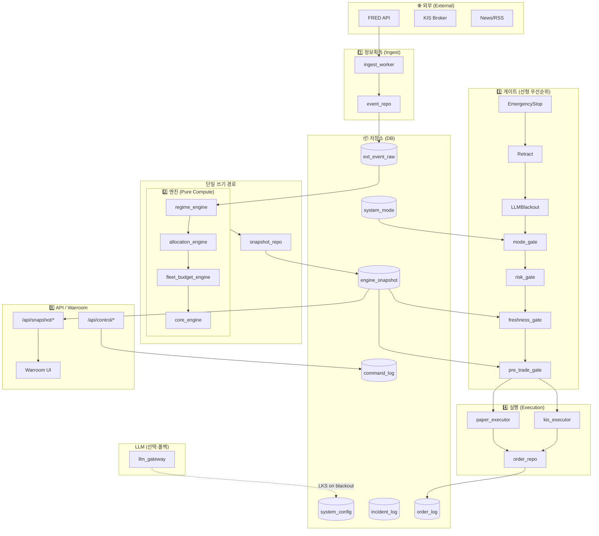

# AEGIS-X v3 전체 프로세스맵 및 조직도

**목적**: 시스템 전체 프로세스·모듈·신호 흐름을 고도 복잡도에 맞게 정의. Schema/Interface Master와 연동하여 폴트 방지.

---

## 1. 프로세스 흐름 (단계별)

```
[1. 수집 Ingest]  →  [2. 국면 Regime]  →  [3. 할당 Allocation]  →  [4. 함대예산 Fleet Budget]
        ↓                      ↓                     ↓                          ↓
   ext_event_raw          regime_current      allocation_matrix           fleet_budget_snapshot
        ↓                      ↓                     ↓                          ↓
[5. 코어포스 Core Force]  →  [6. Pre-Trade Gate]  →  [7. 실행 Execution]  →  [8. 스냅샷/API/Warroom]
        ↓                      ↓                     ↓                          ↓
   core_force_state         allow/block           order_log              engine_snapshot (SSOT)
                                                                        → /api/snapshot/*, Warroom UI
```

| 단계 | 프로세스 | 담당 모듈 | 입력(신호) | 출력(신호) | DB 테이블 |
|------|----------|-----------|------------|------------|-----------|
| 1 | Ingest | ingest_worker, event_repo | 외부 API(FRED 등), heartbeat | event_type, payload | ext_event_raw |
| 2 | Regime | regime_engine | events_count, trend_score, volatility_state | regime_label, crisis_probability, ... | engine_snapshot (regime_current) |
| 3 | Allocation | allocation_engine | regime_current | base_weights, regime_label | engine_snapshot (allocation_matrix) |
| 4 | Fleet Budget | fleet_budget_engine | allocation_matrix, pilot_config | weights | engine_snapshot (fleet_budget_snapshot) |
| 5 | Core Force | core_engine | regime, battlefield, allocation, fleet_budget, risk_guard | structural_trend_status, trade_signal | engine_snapshot (core_force_state) |
| 6 | Pre-Trade Gate | pre_trade_gate, mode_gate, freshness_gate, risk_gate | core_force_state, regime_current, system_mode | allow_trade, reasons | (무상태) |
| 7 | Execution | paper_executor, kis_executor, order_repo | Gate 통과 시 주문 | execution_status, payload | order_log |
| 8 | Snapshot/API | snapshot_repo, cic API | engines 출력 | 최신 스냅샷 | engine_snapshot |

---

## 2. Gate 우선순위 (SE-50 선형 체인, 병렬 아님)

실행(Execution)은 **아래 순서의 게이트를 모두 통과한 후에만** 허용된다. 하나라도 실패하면 즉시 차단.

1. **EmergencyStop** (system_config gate_emergency_stop_active)
2. **Retract** (system_config gate_retract_active)
3. **LLMBlackout** (system_config llm_blackout_active → Execution Freeze)
4. **Session** (Follow-the-Sun: active_session == "OFF" → block new orders, allow_only_risk_reduction)
5. **Mode** (BACKTEST 시 주문 금지)
6. **Risk** (risk_guard: DD/VolSpike + usd_exposure_ratio, fx_volatility 제한)
7. **Freshness** (regime_current, allocation_matrix 최신 ≤ 120초)
8. **Pre-Trade** (structural_trend_status ≠ BROKEN)
9. **Strategy** (통과 시에만 실행 허용)

구현: `backend/app/gates/gate_chain.run_gate_chain(db)`.

---

## 3. 조직도 형태 시각화 (Mermaid)

아래 다이어그램은 **시스템을 조직도처럼** 계층·담당·인터페이스로 표현한다.



---

## 4. 계층별 역할 요약

| 계층 | 역할 | 원칙 |
|------|------|------|
| **외부** | FRED, KIS, 뉴스 등 데이터 소스 | ICD(03) Failure Handling, check_comm 점검 |
| **Ingest** | 외부 → ext_event_raw | event_repo 단일 쓰기 |
| **DB** | SSOT: engine_snapshot, system_mode, system_config, command_log, incident_log, order_log | 모든 읽기/쓰기 계약은 Signal Interface Master 준수 |
| **Engines** | Pure dict→dict, 수식 Locking | DB/HTTP/LLM 직접 호출 금지 |
| **Gates** | Mode/Freshness/Risk/Structural Trend 검사 | 하나라도 FAIL → 주문 차단 |
| **Execution** | Gate 통과 시에만 order_repo 경유 기록 | PAPER/KIS 분기 |
| **API/Warroom** | engine_snapshot 읽기 전용, 계산 금지 | Zero-Flash, fetch/SSE만 |

---

## 5. 신호 인터페이스 참조

- **스냅샷 키·스키마·모듈 입출력**: `docs/Signal_Interface_Master.md` 및 `db/signal_interface_master.json` 참조.
- **LLM 사용 시**: 특정 LLM 통신 두절이 시스템 실행 안정성 하락으로 이어지지 않도록 `docs/LLM_Fallback_Plan.md` 및 `llm_gateway` 폴백 적용.
- **MetaScore**: `a*Sharpe + b*Expectancy - c*MaxDrawdown`, 계수는 system_config `metascore_params`. `backend/app/core/metascore.py`.
- **Hash Chain**: engine_snapshot / order_log 에 prev_hash, self_hash (migration 003). 검증: `scripts/verify_hash_chain.py`.
- **Snapshot 무결성**: 1사이클 후 필수 키 존재 검사: `scripts/snapshot_integrity_check.py`.

---

*문서 버전: v1.1 | Process Map + Gate Linear Order + Freeze Protocol*
